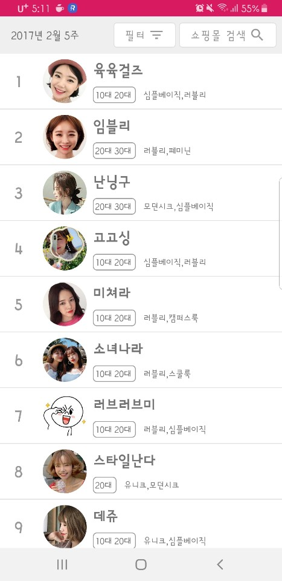
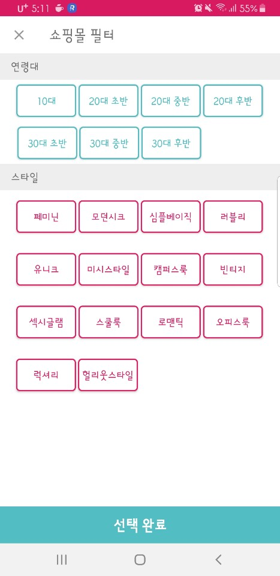
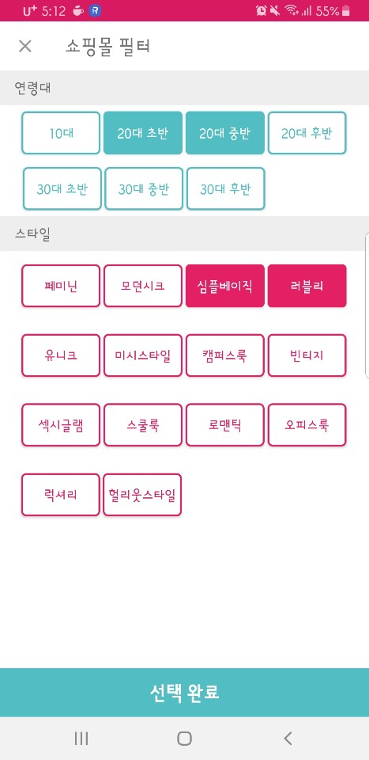
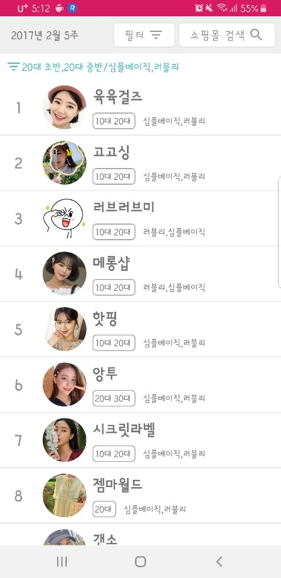

## **Zigzag** / 정우진 (wjddnwls918)

### 개발 환경
- 주 언어 : Kotlin
- 아키텍처 : MVVM(Model-View-ViewModel)

------------------------------------------

### 사용 라이브러리
- [CircleImageView](https://github.com/hdodenhof/CircleImageView)
- [Viewmodel](https://developer.android.com/topic/libraries/architecture/viewmodel)
- [Databinding](https://developer.android.com/topic/libraries/data-binding?hl=ko)

- [Glide](https://github.com/bumptech/glide)
- [Gson](https://github.com/google/gson)

------------------------------------------

### 주요 기능

#### 1.쇼핑 목록

  
 
#### 2.필터

#### 3.필터 결과

------------------------------------------
- KOREATECH
- Computer Science Engineering
- UOC LAB
- email : wjddnwls918@naver.com
- phone : 010-9368-5828
